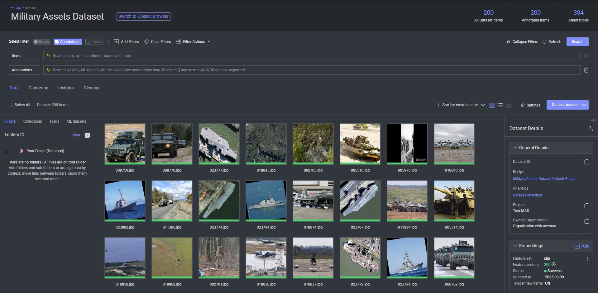
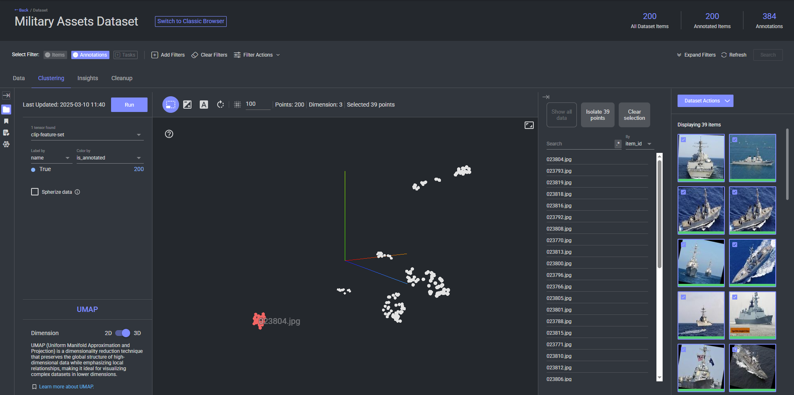
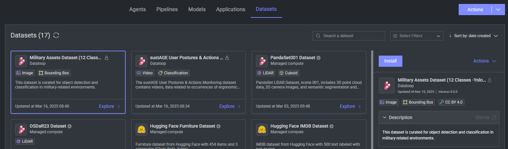

# Dataset adapter for Military Assets Dataset (12 Classes -Yolo8 Format)

This dataset adapter streamlines the conversion of the [Military Assets Dataset (12 Classes - YOLOv8 Format)](https://www.kaggle.com/datasets/rawsi18/military-assets-dataset-12-classes-yolo8-format) 
into a format compatible with the Dataloop platform. \
It creates a dataset on Dataloop with a sample of 200 images, each annotated with bounding boxes across 12 object classes.

And include CLIP embeddings over all the dataset items, enabling clustering based on their embedded representations.

## Installation

1. Navigate to **Marketplace**.
2. Select **Datasets**.
3. Choose the `Military Assets Dataset (12 Classes -Yolo8 Format)` from the list of available datasets.
4. Click on **Install**.

After a while, a new dataset will be created and visible under your **Data** section.
